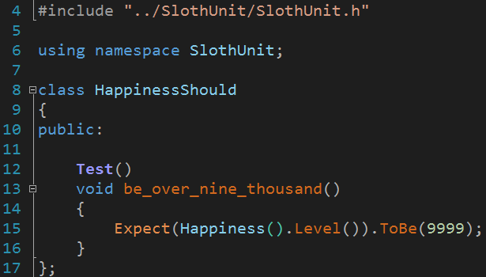

# SlothUnit

SlothUnit is a C++ unit testing framework relying on reflection, implemented using code generation. It aims to be really simple to use, expressive and easy to setup. More than anything, trying to be really familiar to your usual C++ code, so you are not required to study it in-depth to be able to start using it fluently (no learning curve whatsoever!).

## Current status

As of today, SlothUnit is still starting out. Only available in VS, there are just a few simple assertions for bools, strings, integers and floats. But it may be used for fun on some katas or in pretty small projects where you don't need more than that :)

## Setup

### Usage

At the moment I'm figuring out how to upload a VS project template to start out with an online project template. Or a NuGet package.

### Development

1. Simply fork and clone the repo, the whole project is inside a VS solution.

## Writing a test

